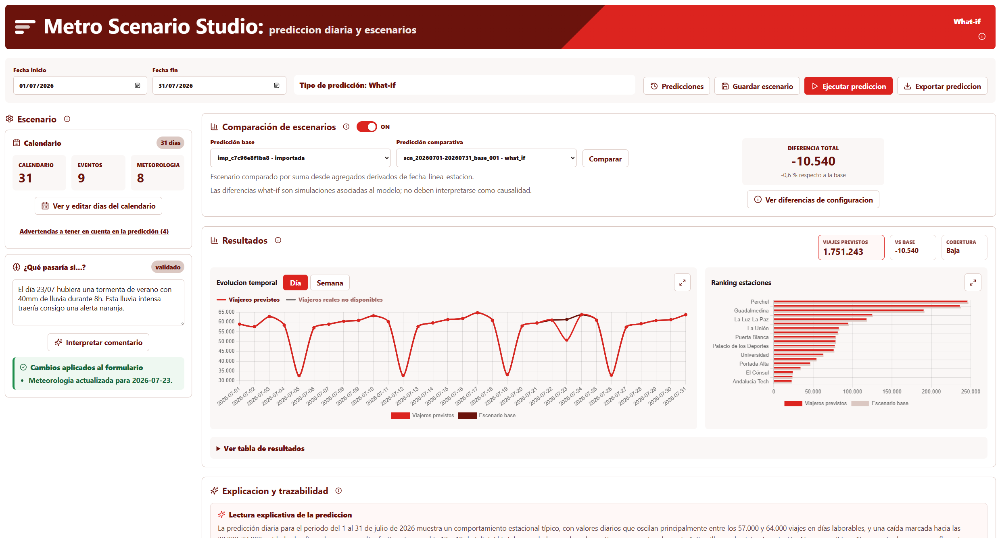

# Metro Scenario Studio

> **Aviso de uso académico**
>
> Este repositorio forma parte del Trabajo Fin de Máster de Darío Jáuregui Hernández en el Máster Universitario en Inteligencia Artificial de UNIR.
>
> El código se publica únicamente con fines de revisión y evaluación académica. No se autoriza su uso comercial, redistribución, explotación en producción ni incorporación en productos o servicios de terceros sin autorización expresa del autor.
>
> El repositorio no contiene datos internos de explotación, credenciales ni ficheros brutos de Metro de Málaga.

Metro Scenario Studio es un monorepo local autonomo para construir, validar y explotar modelos diarios de demanda de Metro de Malaga. El objetivo es que un equipo pueda actualizar datos, reentrenar modelos, simular escenarios what-if, explicar predicciones con trazabilidad y observar el estado tecnico desde una unica carpeta de trabajo.

La carpeta `project-MetroScenarioStudio` es la unidad de trabajo. El paquete Python vive dentro de `ml_pipeline` y no requiere repositorios externos para ejecutarse en local.



## Estructura

- `ml_pipeline/`: paquete Python de entrenamiento, inferencia, drift y artefactos de modelos.
- `platform/backend/`: API FastAPI, SQLite local, exportacion/importacion Excel y endpoint Prometheus `/metrics`.
- `platform/frontend/`: aplicacion React/Vite.
- `pipelines/`: orquestador diario local para refrescar datos, reentrenar y validar modelos.
- `data/`: datos locales y punteros DVC para maestros pesados.
- `infrastructure/`: Docker Compose local con backend, frontend, MLflow, Prometheus y Grafana.

## Alcance Actual

- Todo el desarrollo activo vive dentro de `project-MetroScenarioStudio`.
- `ml_pipeline/conf/base/config.toml` resuelve datos desde `../data`; `ml_pipeline/conf/local/config.toml` queda solo para overrides locales ignorados por Git.
- El backend usa `ml_pipeline` como raiz de artefactos y `platform/backend/storage/demanda_historica_MM.csv` como historico real por defecto.
- Docker Compose levanta plataforma, observabilidad y MLflow para uso local.
- Quedan fuera de esta fase el remoto DVC compartido, registry corporativo, promocion formal de modelos y alertas conectadas a canales reales.

## Instalacion Local

```powershell
py -3.12 -m venv .venv
.\.venv\Scripts\python.exe -m pip install --upgrade pip
.\.venv\Scripts\python.exe -m pip install -e "ml_pipeline[dev]"
.\.venv\Scripts\python.exe -m pip install -e "platform/backend[dev]"
cd platform\frontend
npm ci
```

`ml_pipeline/conf/base/config.toml` resuelve los datos desde `../data` y los artefactos desde `ml_pipeline/artifacts`. Si un equipo necesita sobrescrituras locales, copie `ml_pipeline/conf/local/config.template.toml` a `ml_pipeline/conf/local/config.toml`; ese archivo esta ignorado por Git.

## Arranque de la Plataforma

```powershell
.\MetroScenarioStudio.cmd
```

URLs:

- Frontend: `http://127.0.0.1:5173`
- Backend: `http://127.0.0.1:8011`
- Metricas Prometheus: `http://127.0.0.1:8011/metrics`

El backend lee eventos y meteorologia desde `data/` mediante `MSS_DATA_ROOT`. Por defecto apunta a la carpeta `data` del monorepo. Si se necesita otra ubicacion:

```powershell
$env:MSS_DATA_ROOT = "D:\metro\data"
```

Para explicabilidad y lectura de comentarios what-if con un LLM local, el backend usa por defecto:

```powershell
$env:MSS_NLU_ENDPOINT = "http://127.0.0.1:1234/v1/chat/completions"
$env:MSS_EXPLANATION_LLM_ENDPOINT = "http://127.0.0.1:1234/v1/chat/completions"
$env:MSS_EXPLANATION_LLM_TIMEOUT_SECONDS = "900"
```

En Docker se usa `host.docker.internal` para que los contenedores lleguen al LLM que corre en la maquina host.

Para parar procesos lanzados por el script:

```powershell
powershell -ExecutionPolicy Bypass -File .\scripts\stop-metro-scenario-studio.ps1
```

Para liberar puertos habituales del proyecto (`80`, `3000`, `5000`, `8000`, `8011`, `8080`, `9090`, `5173`) y bajar el stack Docker si esta activo:

```powershell
.\VaciarPuertosMetroScenarioStudio.cmd
```

Modo simulacion, sin parar procesos:

```powershell
.\VaciarPuertosMetroScenarioStudio.cmd -WhatIf
```

Puertos concretos:

```powershell
.\VaciarPuertosMetroScenarioStudio.cmd -Ports 8000,8011,5173
```

## Verificacion

```powershell
.\.venv\Scripts\python.exe -m pytest platform\backend\tests -q
.\.venv\Scripts\python.exe -m pytest ml_pipeline\tests -q
cd platform\frontend
npm run build
```

## Pipeline Diario

El pipeline se ejecuta desde la raiz del monorepo:

```powershell
.\.venv\Scripts\python.exe pipelines\run_pipeline.py
```

La configuracion versionada vive en `pipelines/pipeline_config.json`. `models_repo_dir` y `platform_repo_dir` son relativos a la raiz del monorepo por defecto. `data_source_dir` apunta a la carpeta local donde cada entorno tenga los CSV diarios de validaciones brutas. Para una maquina concreta, copie `pipelines/pipeline_config.json` a `pipelines/config.json`; ese archivo local esta ignorado por Git y tiene prioridad al ejecutar el pipeline.

Para construir datasets operativos completos, deben existir en `data/raw` los workbooks configurados en `ml_pipeline/conf/base/config.toml`: `Servicios Hist*.xlsx`, `Calendario_Eventos.xlsx` e `Incidencias_Historico.xlsx`. Si faltan, el pipeline marca ese paso como `skipped` y continua con entrenamiento, evaluacion, inferencia smoke y drift.

La descarga corporativa de historico real usa opcionalmente `sp_DataCenterBI`. Para habilitarla, define `METRO_DATACENTER_BI_LIB_PATH` o `datacenter_bi_lib_path` en `pipelines/pipeline_config.json`. Si no esta disponible, el pipeline conserva el CSV historico local existente y continua.

## Trazabilidad MLOps

Cada entrenamiento tabular registra en MLflow y deja un manifest local junto a las metricas:

- `ml_pipeline/artifacts/daily_modeling/metrics/*__run_manifest.json`
- parametros efectivos del modelo y variante
- columnas de features utilizadas
- ruta y hash del dataset cuando esta disponible
- hash, tamano y existencia de artefactos generados
- commit/branch/estado Git detectado

MLflow usa por defecto `ml_pipeline/mlruns`; puede apuntar a un servidor externo mediante `ml_pipeline/conf/local/config.toml` o la configuracion base.

El pipeline diario genera un resumen estructurado en:

- `ml_pipeline/artifacts/monitoring/pipeline_run_summary.json`

La monitorizacion genera:

- `ml_pipeline/artifacts/monitoring/drift_metrics.json`
- `ml_pipeline/artifacts/monitoring/monitoring_summary.json`

El endpoint `/metrics` expone WAPE/SMAPE, drift, estado de monitorizacion, estado de ultima ejecucion del pipeline y edad de artefactos clave.

La calidad de datos se valida en el pipeline con contratos tabulares de Pandera cuando aplica. No hay todavia un frontend especifico de catalogo/calidad de datos; los resultados se consultan en logs, artefactos del pipeline, MLflow, DVC, Prometheus y Grafana.

## Docker y Registry

Construccion local:

```powershell
docker compose -f infrastructure\docker-compose.yml build
docker compose -f infrastructure\docker-compose.yml up -d
```

Pruebas esperadas:

```powershell
Invoke-WebRequest http://127.0.0.1:8011/api/health -UseBasicParsing
Invoke-WebRequest http://127.0.0.1:8011/metrics -UseBasicParsing
Invoke-WebRequest http://127.0.0.1:8080 -UseBasicParsing
Invoke-WebRequest http://127.0.0.1:9090/-/ready -UseBasicParsing
Invoke-WebRequest http://127.0.0.1:3000/api/health -UseBasicParsing
Invoke-WebRequest http://127.0.0.1:5000 -UseBasicParsing
```

URLs del stack Docker:

- Frontend: `http://127.0.0.1:8080`
- Backend API: `http://127.0.0.1:8011`
- Metricas Prometheus crudas del backend: `http://127.0.0.1:8011/metrics`
- Prometheus: `http://127.0.0.1:9090`
- Grafana: `http://127.0.0.1:3000` (credenciales locales configuradas en `infrastructure/docker-compose.yml`)
- MLflow: `http://127.0.0.1:5000`

Grafana arranca con el datasource `Prometheus` provisionado y el dashboard `Metro Scenario Studio MLOps`. Prometheus carga reglas de alerta basicas desde `infrastructure/prometheus/alerts.yml`.

El frontend Docker actua como proxy Nginx hacia `/api/` y permite peticiones largas de explicabilidad hasta 900 segundos.

Para etiquetar imagenes hacia un registry:

```powershell
$env:MSS_REGISTRY_PREFIX = "registry.example.com/metro"
$env:MSS_IMAGE_TAG = "dev-20260617"
.\scripts\build-docker-images.ps1
```

Para publicar:

```powershell
docker login registry.example.com
.\scripts\push-docker-images.ps1
```

El prefijo debe incluir host y namespace/proyecto, pero no el nombre final de cada imagen. Los nombres publicados son:

- `metro-scenario-studio-backend`
- `metro-scenario-studio-frontend`

## Datos y DVC

Los datos pesados permanecen fuera de Git. La configuracion versionada de DVC no publica rutas personales. Para trabajar en una maquina concreta, configure un remoto local en `.dvc/config.local` o use `dvc remote add --local`.

El repositorio versiona con DVC:

- maestros externos en `data/external/datos_externos`;
- features externas finales en `data/processed/external_features/external_daily_features.parquet`;
- agregados operativos finales en `data/processed/operations`;
- validacion consolidada actual en `data/processed/validaciones/validaciones_consolidado.parquet`;
- modelos diarios promovidos en `ml_pipeline/artifacts/models/daily_modeling`.

Flujo habitual:

```powershell
.\.venv\Scripts\dvc.exe pull
.\.venv\Scripts\dvc.exe repro daily_pipeline
.\.venv\Scripts\dvc.exe push
```

`dvc.yaml` define el stage `daily_pipeline` para ejecutar `pipelines/run_pipeline.py` y registrar metricas operativas ligeras. El remoto corporativo compartido queda como fase posterior: basta con anadir un remoto DVC local o compartido sin versionar credenciales ni rutas privadas.

## Limites de Esta Fase

Esta fase deja el monorepo listo para uso local autonomo. Quedan como fase posterior: DVC remoto compartido, registry corporativo de contenedores, promocion formal de modelos con MLflow Model Registry, despliegue corporativo, CI/CD de contenedores, orquestador productivo y alertas corporativas conectadas a canales reales.
